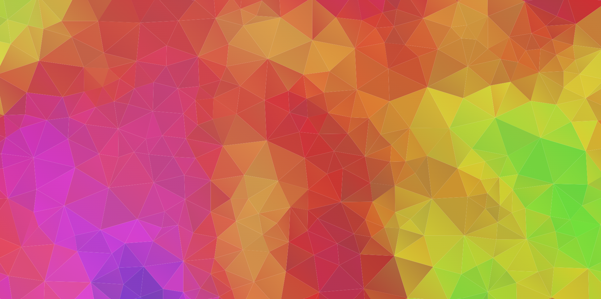

# Tessellator
A little program to create an SVG of randomly tessellated triangles, using perlin noise to add colors. Capable of efficiently creating massive tessellated areas. Because I was bored.

### Examples:

